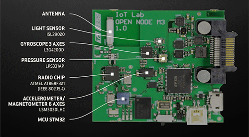

# Internet-of-Things
521043S-3004 Internet of Things 2023

## Instructions:

### How to run the project on IoT-Lab:
1. Login to FIT IoT-Lab by using SSH:
    - ```ssh <username>@<site>.iot-lab.info```

2. Clone the repository:
    - ```git clone https://github.com/jsyrjako/Internet-of-Things.git```

3. Change directory:
    - ```cd Internet-of-Things```

4. Initialize submodules:
    - ```git submodule update --init```

5. Run the project:
    - ```tähän koodia :D```

## Project description:

### [IoT-Lab M3](https://iot-lab.github.io/docs/boards/iot-lab-m3/)


We are using IoT-Lab M3 nodes to measure temperature, pressure and luminosity.

Sensors used:
- Light: ISL29020
- Temperature: LPS331AP
- Pressure: LPS331AP


